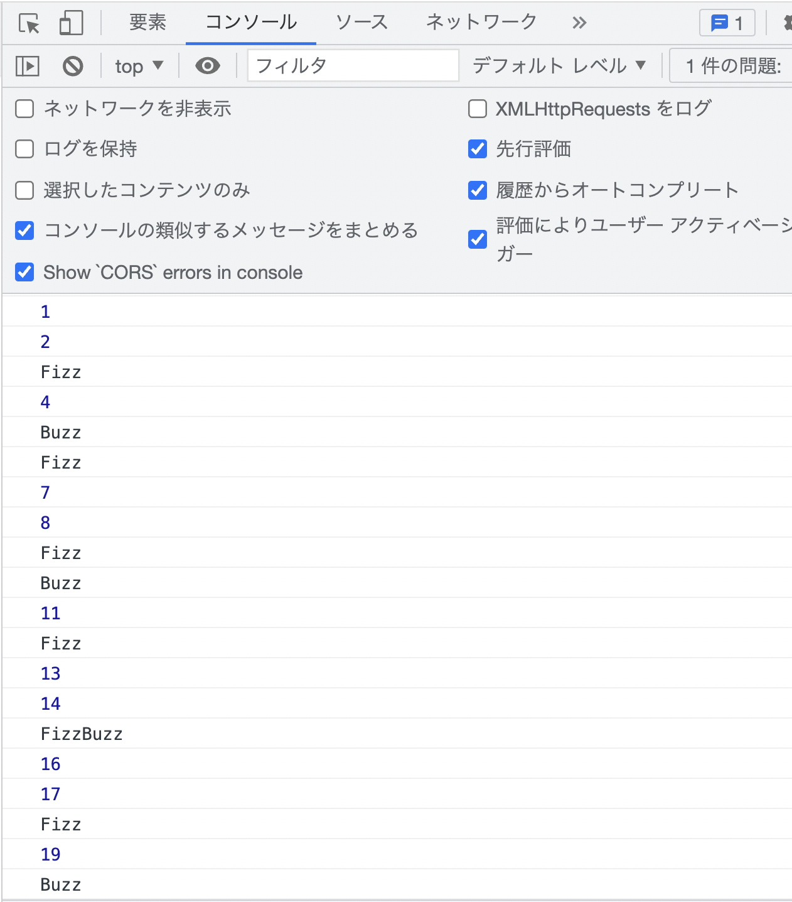

# Javascript基礎課題

この課題では、主にJavascript基礎の理解度チェックを行います。  
分からない問題が出てきた場合には、下記項目を復習してみましょう。  
- 変数
- 配列
- オブジェクト
- if文
- for文

## 問題１
下記の配列から「tennis」を取得し、コンソール上に表示して下さい
```
let sports = ['soccer', 'baseball', 'tennis', 'basketball'];
```
<br>

## 問題２
下記のオブジェクトから「men」を取得し、コンソール上に表示して下さい
```
let person = {
  name: 'Taro',
  age: 28,
  gender: 'men',
  favorite: 'curry'
}
```
<br>

## 問題３
下記の配列・オブジェクトから「Jiro」を取得し、コンソール上に表示して下さい
```
let people1 = [
  {
    name: 'Taro',
    age: 40
  },
  {
    name: 'Jiro',
    age: 33
  },
  {
    name: 'Saburo',
    age: 26
  }
];
```
<br>

## 問題４
下記の配列・オブジェクトから「youtube」を取得し、コンソール上に表示して下さい
```
let people2 = [
  {
    name: 'Taro',
    age: 32,
    favorites: [
      'basketball',
      'Programming'
    ]
  },
  {
    name: 'Jiro',
    age: 30,
    favorites: [
      'tennis',
      'movie'
    ]
  },
  {
    name: 'Saburo',
    age: 27,
    favorites: [
      'baseball',
      'youtube'
    ]
  }
];
```
<br>

## 問題５
for文を用いて、変数「countries」に格納されている配列の中身を一つずつコンソールに表示して下さい
```
let countries = ['Japan', 'China', 'America', 'Spain', 'Germany'];
```
<br>

## 問題６
filterメソッドを用いて、変数「words」に格納されている値のうち、
7文字以上の単語のみからなる新しい配列を作成し、コンソールに表示させて下さい
```
let words = [
  'spray', 'limit', 'elite', 'exuberant', 'destruction', 'present'
];
```
<br>

## 問題７
下記のルールに沿って、コンソール上に1から100までの数字を出力して下さい

**▼ルール**
- 3で割り切れるときは数値ではなく"Fizz"と出力してください。
- 5で割り切れるときは数値ではなく"Buzz"と出力してください。
- 3でも5でも割り切れるときは"FizzBuzz"とつなげて出力してください。

**回答イメージ**
